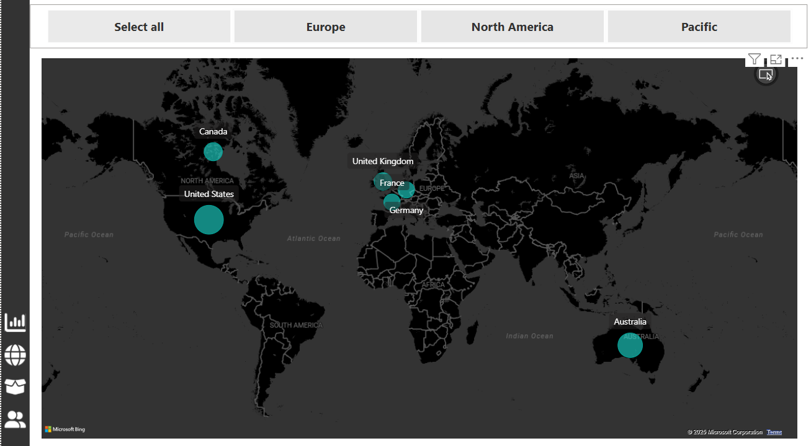

# 📊 AdventureWorks Sales Analysis Dashboard

This project is a comprehensive **Power BI dashboard** created using the AdventureWorks dataset to derive actionable insights from sales, customers, products, and geographic performance.

## 🧾 Project Overview

The objective of this project is to analyze and visualize the business performance of AdventureWorks — a fictitious bicycle and outdoor gear company. The dashboard helps stakeholders understand:

- Customer behavior and segmentation
- Product-wise performance (orders, revenue, and returns)
- Sales trends and regional performance
- KPIs like revenue, profit, return rates, and top customers

## 📌 Key Insights

### 1. **Customer Detail Dashboard**
- **17.4K unique customers** tracked from 2020 to 2022.
- **Top customer:** Mr. Maurice Shan with $12.4K revenue across 6 orders.
- Income and occupation breakdowns show most orders come from average income and professional groups.

### 2. **Executive Dashboard**
- **Revenue:** $24.9M | **Profit:** $10.5M | **Orders:** 25.2K
- **Top product categories:** Accessories (17K), followed by Bikes and Clothing.
- Monthly KPIs with trendlines show consistent growth post mid-2021.

### 3. **Global Map Dashboard**
- Geographic customer distribution across **North America, Europe, and Pacific regions**.
- Highest activity in **United States**, **Canada**, and **Australia**.

### 4. **Product Detail Dashboard**
- Focused view on top-performing product: **Water Bottle - 30 oz.**
- Monthly breakdown of orders, revenue, and profit vs target.
- Profit and adjusted profit show a **230%+ increase YoY**.
- Return % analysis highlights products with potential issues.

## 🛠 Tools & Technologies

- **Power BI Desktop**
- **DAX and Power Query**
- **Data Modeling & Relationships**
- **Interactive Visuals** (line charts, donut charts, maps, slicers)
- **AdventureWorks Dataset**

## 📸 Dashboard Previews

| Customer Insight | Executive Summary | Map View | Product Insight |
|------------------|-------------------|----------|-----------------|
|  |  |  |  |

## 📁 Dataset

This project uses Microsoft’s **AdventureWorks** sample dataset.

## 📈 Skills Demonstrated

- Business KPI tracking
- Drill-through & cross-filtering
- Custom measures with DAX
- Dynamic time slicing
- Product performance analysis

---

## 🚀 How to Use

1. Download the `.pbix` file from this repository.
2. Open using **Power BI Desktop**.
3. Interact with slicers (Year, Region, Product Type) to explore trends.

---

## 🤝 Let's Connect!

If you liked this project or have suggestions, feel free to reach out or connect with me on [LinkedIn](#).
